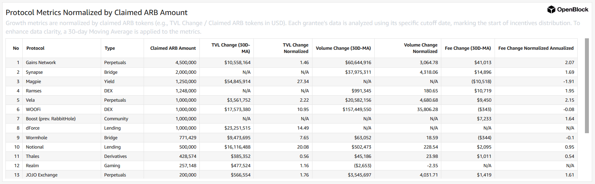
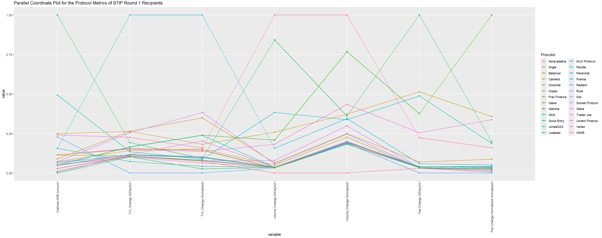
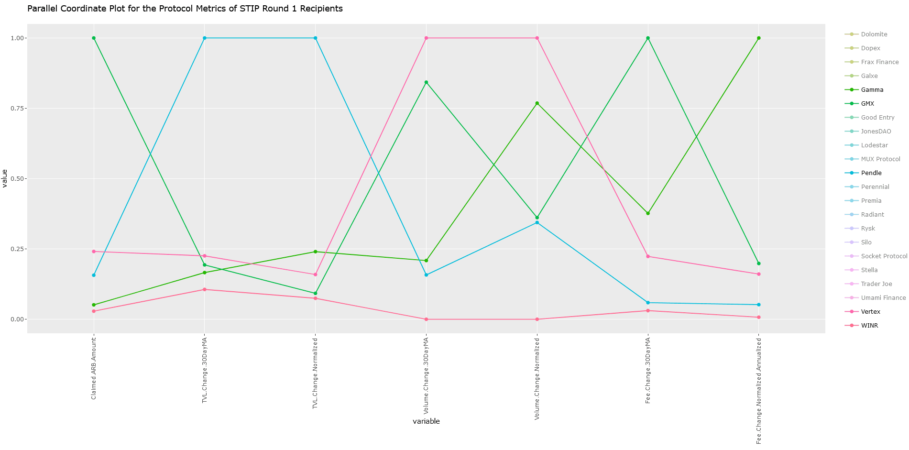
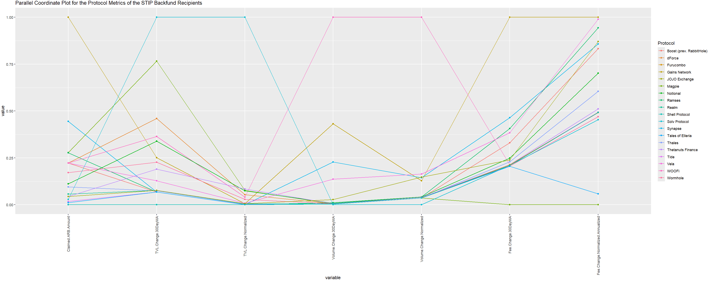
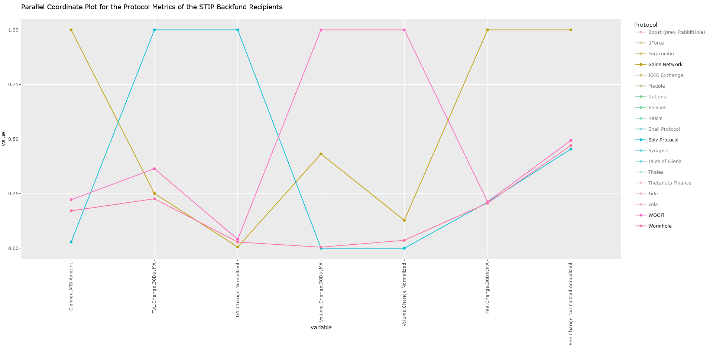

# ARBstipKPIAnalysis
Analyzing STIP grant recipient KPIs from OpenBlockLabs using interactive Parallel Coordinate Plots in R


<hr>

### Description
OpenBlock Labs has teamed up with Arbitrum to provide incentive modeling for recipeints of the DAO’s Short-Term Incentive Program (STIP). The aim of their data-driven platform is to provide dedicated incentive engineering, that fosters sustainable growth with decentralized protocols. As part of their mandate, they’ve produced two dashboards tracking the performance of programs that participated in the program.  

## [Data for the Round 1 comes from here:](https://www.openblocklabs.com/app/arbitrum/overview) <<< Click Here

## [Data for the backfund round came from here:](https://www.openblocklabs.com/app/arbitrum/backfund/overview) <<< Click Here


<div align="center">Data Structure</div>
&nbsp;
&nbsp;

<hr>

### Analysis STIP Round 1

### [Analysis STIP Round 1 Interactive Graph:]() <<< Click Here

The data from this dashboard tracking KPIs was extracted and visualized as parallel coordinate plots for easier interpretation. These growth metrics have been normalized by claimed ARB tokens (e.g., TVL Change / Claimed ARB tokens in USD). Each grantee's data is analyzed using its specific cutoff date that marks the start of the incentives distribution. They also included a 30 day moving average as well. Both the “Round 1” and “BackFunded” phases of the Short Term Incentive Program saw programs claim tokens that were then used to promote activity on their platform. For both phases, OpenBlock tracked the change in TVL, transaction volume, platform fees and network fees.  The metrics ultimately track how much value is locked in these protocols, how many people are utilizing them, and how much money are they generating for the protocol themselves and for Arbitrum. 


<div align="center">Graph for the Round 1 programs</div>
&nbsp;
&nbsp;

With key KPI metrics on the x-axis and normalized values on the y-axis, the parallel coordinate plot shows how each protocol ranks across each variable compared to one another. From the overall plot there, are obvious outliers with higher TVL, Volume and Fee generation than others. By subsetting the list of protocols we can see these more clearly.


<div align="center">Standouts </div>
&nbsp;
&nbsp;

This highlights how Pendle claimed a relatively small amount of $ARB, but had the largest positive TVL change.  Vertex, similarly, had the highest uptick in volume as a result of their STIP program, while GMX had the highest fee change of all of the Round1 projects tracked. To investigate further, please view the following interactive graph.

<hr>

### Analysis STIP Backfunding

### [Analysis STIP Backfunding Interactive Graph:]() <<< Click Here

The round of “BackFunded”  projects represent those approved for $23,000,000 after missing the initial proposal.  These protocols can be found in the graph below.


<div align="center">Graph for the STIP Backfunding</div>
&nbsp;
&nbsp;

Like the first round, we can subset the groups to better see the higher performing protocols.


<div align="center">Standouts </div>
&nbsp;
&nbsp;

Here we see Solv Protocol, with the highest performing TVL changes, WooFi with the highest volume, and the Gains Netowrk with the highest fee accrual.

<hr>

### Code used to make PCP Plots

#### Package Installation and Loading

```
install.packages("hrbrthemes")
install.packages("GGally")
install.packages("plotly")
library(hrbrthemes)
library(GGally)
library(plotly)
```

1.	Package Installation: The `install.packages()` function is used to download and install packages in R from CRAN (the Comprehensive R Archive Network). This code installs three packages: `hrbrthemes`, `GGally`, and `plotly`.
	+ 	`hrbrthemes`: Provides additional themes and font options for enhanced visuals in ggplot2.
	+ 	`GGally`: Extends ggplot2 by adding several functions to reduce the complexity of combining geometric objects with transformed data. It's particularly known for its `ggpairs` function, but here it's used for parallel coordinate plots.
	+ 	`plotly`: Offers an interface to create interactive plots. It can work with ggplot2 objects to make them dynamic.
2.	Library Loading: The `library()` function is called to load the installed packages into the R session, making their functions available for use.

#### Data Loading

```
STIPRound1<-read.csv(file=file.choose())
data1 <- STIPRound1
STIPBackfund<-read.csv(file=file.choose())
data2 <- STIPBackfund
```

1.	Data Importation: `read.csv()` is used to import data from CSV files. The `file.choose()` function opens a dialog box allowing the user to select a file interactively. This data is then assigned to variables for further processing.
	+ 	`STIPRound1` and `STIPBackfund` are variables holding the datasets from the chosen files.
	+ 	`data1` and `data2` are duplicates of the datasets, which seems redundant in this context unless the intention is to preserve the original datasets for further use.

#### Data Visualization Parallel Coordinate Plot for STIP Round 1 Recipients

```
STIPRound1.plot<-ggparcoord(STIPRound1, columns = 4:10, groupColumn = 2, showPoints = TRUE, scale="uniminmax", title = "Parallel Coordinate Plot for the Protocol Metrics of STIP Round 1 Recipients")+theme(axis.text.x = element_text(angle = 90, vjust = 0.5, hjust=1))
STIPRound1.plot
ggplotly(STIPRound1.plot)
```

1.	Creating the Plot: The `ggparcoord()` function from the GGally package creates a parallel coordinate plot. It's used to plot multivariate data to explore patterns.
	+ 	`columns = 4:10`: Specifies the columns from the dataset to be plotted.
	+ 	`groupColumn = 2`: Designates a column used to group the data, which affects the color coding of the lines.
	+ 	`showPoints = TRUE`: Adds points at the intersections of lines with axes.
	+ 	`scale="uniminmax"`: Normalizes the data on a per-column basis to make it comparable across the plot.
	+ 	The `title` adds a descriptive label to the plot.
	+ 	`theme(axis.text.x = ...)`: Adjusts the x-axis text for better readability, by rotating it and adjusting its alignment.
2.	Display and Interactivity:
	+ 	`STIPRound1.plot` displays the static plot.
	+ 	`ggplotly(STIPRound1.plot)` converts the ggplot object into an interactive Plotly plot.

#### Data Visualization Parallel Coordinate Plot for STIP Backfund Recipients

```
STIPBackfund.plot<-ggparcoord(STIPBackfund, columns = 4:10, groupColumn = 2, showPoints = TRUE, scale="uniminmax", title = "Parallel Coordinate Plot for the Protocol Metrics of the STIP Backfund Recipients")+theme(axis.text.x = element_text(angle = 90, vjust = 0.5, hjust=1))
STIPBackfund.plot
ggplotly(STIPBackfund.plot)
```

1.	This section does essentially the same as the previous one but for the `STIPBackfund` dataset. It also creates a parallel coordinate plot, displays it, and then makes it interactive with `ggplotly()`.

#### Summary

The script is designed for data visualization of multivariate data using parallel coordinate plots, which are effective for spotting patterns, trends, and outliers in data that spans multiple dimensions. The use of `plotly` to add interactivity enhances the usability of the plots, allowing users to hover over points and lines to see more detailed information. The redundancy in defining `data1` and `data2` could be eliminated unless there's a specific reason for keeping the original datasets intact.

<hr>

### Conclusion

In conclusion, it's advisable to interview the top-performing platforms across total value locked (TVL), volume, and fee metrics for both back-funded and round 1 initiatives. The goal is to understand how they designed their incentive mechanisms to achieve such results. By sharing these insights, other protocols could adopt similar incentive structures to boost participation on their platforms, enhance key performance indicators (KPIs), and ultimately contribute to the growth of the overall Arbitrum ecosystem.


