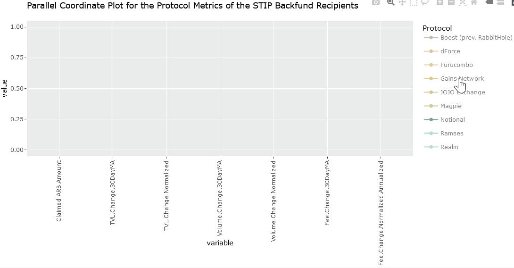

# ARBstipKPIAnalysis
Analyzing STIP grant recipient KPIs from OpenBlockLabs using interactive Parallel Coordinate Plots in R

### Description
OpenBlock Labs has teamed up with Arbitrum to provide incentive modeling for recipeints of the DAO’s Short-Term Incentive Program (STIP). The aim of their data-driven platform is to provide dedicated incentive engineering, that fosters sustainable growth with decentralized protocols. As part of their mandate, they’ve produced two dashboards tracking the performance of programs that participated in the program.  

## [Data for the Round 1 comes from here:](https://www.openblocklabs.com/app/arbitrum/overview) <<< Click Here

## [Data for the backfund round came from here:](https://www.openblocklabs.com/app/arbitrum/backfund/overview) <<< Click Here

Data Structure

&nbsp;
&nbsp;

### Analysis STIP Round 1

The data from this dashboard tracking KPIs was extracted and visualized as parallel coordinate plots for easier interpretation. These growth metrics have been normalized by claimed ARB tokens (e.g., TVL Change / Claimed ARB tokens in USD). Each grantee's data is analyzed using its specific cutoff date that marks the start of the incentives distribution. They also included a 30 day moving average as well. Both the “Round 1” and “BackFunded” phases of the Short Term Incentive Program saw programs claim tokens that were then used to promote activity on their platform. For both phases, OpenBlock tracked the change in TVL, transaction volume, platform fees and network fees.  The metrics ultimately track how much value is locked in these protocols, how many people are utilizing them, and how much money are they generating for the protocol themselves and for Arbitrum. 

Graph for the Round 1 programs

&nbsp;
&nbsp;

With key KPI metrics on the x-axis and normalized values on the y-axis, the parallel coordinate plot shows how each protocol ranks across each variable compared to one another. From the overall plot there, are obvious outliers with higher TVL, Volume and Fee generation than others. By subsetting the list of protocols we can see these more clearly.

Standouts 

&nbsp;
&nbsp;

This highlights how Pendle claimed a relatively small amount of $ARB, but had the largest positive TVL change.  Vertex, similarly, had the highest uptick in volume as a result of their STIP program, while GMX had the highest fee change of all of the Round1 projects tracked. To investigate further, please view the following interactive graph.

## [Analysis STIP Round 1 Interactive Graph:]() <<< Click Here

### Analysis STIP Backfunding

The round of “BackFunded”  projects represent those approved for $23,000,000 after missing the initial proposal.  These protocols can be found in the graph below.

Graph for the STIP Backfunding

&nbsp;
&nbsp;

Like the first round, we can subset the groups to better see the higher performing protocols.

Standouts 

&nbsp;
&nbsp;

Here we see Solv Protocol, with the highest performing TVL changes, WooFi with the highest volume, and the Gains Netowrk with the highest fee accrual.

## [Analysis STIP Backfunding Interactive Graph:]() <<< Click Here

In conclusion, it's advisable to interview the top-performing platforms across total value locked (TVL), volume, and fee metrics for both back-funded and round 1 initiatives. The goal is to understand how they designed their incentive mechanisms to achieve such results. By sharing these insights, other protocols could adopt similar incentive structures to boost participation on their platforms, enhance key performance indicators (KPIs), and ultimately contribute to the growth of the overall Arbitrum ecosystem.

